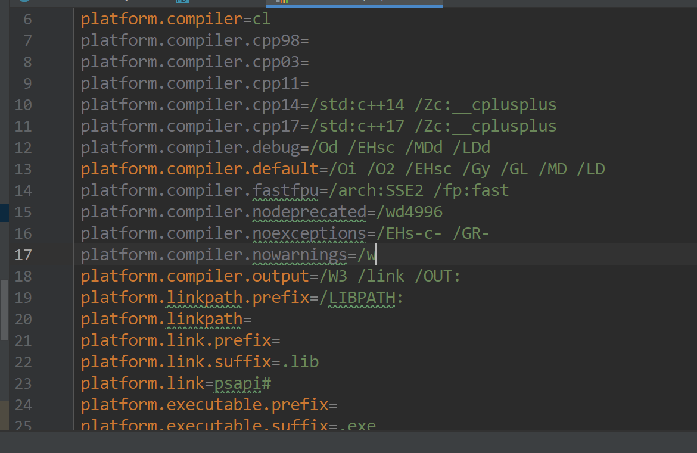

# Guide
## 1.环境配置
我在windows上搭建的环境，要有Java8环境，VS2022环境。  

环境变量配置如下(注意最后一项填你的目录)，在cl编译的时候会从LIB和INCLUDE环境变量查找h文件和dll文件，方便起见直接都丢进去，也可以自定义一个路径，我直接写项目的resources目录了，之后需要编译的h文件往里扔就行：
```shell
LIB:
C:\Program Files\Microsoft Visual Studio\2022\Community\VC\Tools\MSVC\14.40.33807\lib\x64;C:\Program Files\Microsoft Visual Studio\2022\Community\VC\Tools\MSVC\14.40.33807\lib\x64\uwp;C:\Program Files\Microsoft Visual Studio\2022\Community\VC\Tools\MSVC\14.40.33807\lib\x64\store;C:\Program Files (x86)\Windows Kits\10\Lib\10.0.22621.0\um\x64;C:\Program Files (x86)\Windows Kits\10\Lib\10.0.22621.0\ucrt\x64;C:\Users\<你的用户名>\Desktop\javacpp\src\main\resources;

INCLUDE:
C:\Program Files\Microsoft Visual Studio\2022\Community\VC\Tools\MSVC\14.40.33807\include;C:\Program Files (x86)\Windows Kits\10\Include\10.0.22621.0\ucrt;C:\Program Files (x86)\Windows Kits\10\Include\10.0.22621.0\shared;C:\Program Files (x86)\Windows Kits\10\Include\10.0.22621.0\um;C:\Program Files (x86)\Windows Kits\10\Include\10.0.22621.0\winrt;C:\Users\<你的用户名>\Desktop\javacpp\src\main\resources;

PATH:
C:\Program Files\Microsoft Visual Studio\2022\Community\VC\Tools\MSVC\14.40.33807\bin\Hostx64\x64
```

## 2.单个h文件试手运行
由于本人比较懒，所以直接用他提供的方法进行编译，只需要一个h文件，一个java文件，就可以用java调用h里面写好的方法。  

MyExample.h:
```cpp

int add(int a, int b) {return a + b;}
void sayHello() {}

```
MyExample.java:
```java
package com.example;

import org.bytedeco.javacpp.Loader;
import org.bytedeco.javacpp.annotation.Platform;
import org.bytedeco.javacpp.tools.Builder;
import org.bytedeco.javacpp.tools.Logger;

import java.io.File;

@Platform(include = "MyExample.h", library = "MyExample")
public class MyExample {
    private static final Logger logger = Logger.create(MyExample.class);
    static {
//        Loader.load();
    }


    public static native int add(int a, int b);
    public static native void sayHello();
    public static void main(String[] args) throws Exception {

        // Generate的步骤：
        System.setProperty("java.library.path", new File(".").getAbsolutePath() + File.pathSeparator + System.getProperty("java.library.path"));
        logger.info(System.getProperty("java.library.path"));

        Class c = MyExample.class;
        new Builder().classesOrPackages(c.getName()).build();
        Loader.load(c);

        System.out.println(add(1, 2));

        sayHello();
    }
}

```
运行MyExample.java,会先把h文件转换成jnijavacpp.cpp.这个文件是用文件里面的模板生成的jni cpp文件：
jnijavacpp.cpp,代码在根路径。
那么就会在   

   

生成对应的dll文件。  

现在我们有h文件，有dll文件了，就可以调起来了：


MyExample.java:
```java
package com.example;

import org.bytedeco.javacpp.Loader;
import org.bytedeco.javacpp.annotation.Platform;
import org.bytedeco.javacpp.tools.Builder;
import org.bytedeco.javacpp.tools.Logger;

import java.io.File;

@Platform(include = "MyExample.h", library = "MyExample")
public class MyExample {
    private static final Logger logger = Logger.create(MyExample.class);
    static {
        System.setProperty("java.library.path", new File(".").getAbsolutePath() + File.pathSeparator + System.getProperty("java.library.path"));
        logger.info(System.getProperty("java.library.path"));
        Loader.load();
    }


    public static native int add(int a, int b);
    public static native void sayHello();
    public static void main(String[] args) throws Exception {
//        Class c = MyExample.class;
//        new Builder().classesOrPackages(c.getName()).build();
//        Loader.load(c);

        System.out.println(add(1, 2));
        sayHello();
    }
}
 
```   
运行这个文件，就可以把dll+h文件当成java调用了。


## 3.假如我有只有一个h和一个dll和lib怎么办

那我们写一个简单的动态链接库试试手。  
首先VS创建一个动态链接库项目，主要代码：   

HeadAndDll.h:   
```cpp
#include<iostream>

__declspec(dllexport) int add(int a, int b);
__declspec(dllexport) void sayHello();

```   

HeadAndDll.cpp:   
```cpp
#include"HeadAndDll.h"

int add(int a, int b) { return a + b; }
void sayHello() {}

```  

直接打包，得到：   


复制HeadAndDll.h, HeadAndDll.dll, HeadAndDll.lib到resources目录。   

接下来需要一个Java类与其对接：  

HeadAndDllTest.java:
```java
package com.example;

import org.bytedeco.javacpp.Loader;
import org.bytedeco.javacpp.annotation.Platform;
import org.bytedeco.javacpp.tools.Builder;
import org.bytedeco.javacpp.tools.Logger;

import java.io.File;
// 注意是link
@Platform(include = "HeadAndDll.h", link = "HeadAndDll")
public class HeadAndDllTest {

    private static final Logger logger = Logger.create(com.example.MyExample.class);
    static {
        System.setProperty("java.library.path", new File(".").getAbsolutePath() + File.pathSeparator + System.getProperty("java.library.path"));
        logger.info(System.getProperty("java.library.path"));
        Loader.load();
    }


    public static native int add(int a, int b);
    public static native void sayHello();
    public static void main(String[] args) throws Exception {
        System.out.println(add(1, 2));
        sayHello();
    }
}

```   
老流程，我们需要先把Java类用模板填充为jni cpp,再编译成一个可jni调用的dll.Build完成之后就会在target目录下生成对应的文件。

BuildHeadAndDll.java
```java
public class BuildHeadAndDll {
    public static void main(String[] args) throws Exception {
        System.setProperty("java.library.path", new File(".").getAbsolutePath() + File.pathSeparator + System.getProperty("java.library.path"));
        String[] builderArgs = {"com/example/HeadAndDllTest"};
        Builder.main(builderArgs);
    }
}
```
这个时候我们运行HeadAndDllTest.java会发现找不到依赖，那么依赖在哪里呢，就是咱们在前面需要链接的dll，把他扔到这个target目录去。   

   


接下来就可以快乐地运行HeadAndDllTest.java了。


## 4.易错的路径

如果从简，直接吧cl命令用到的所有h文件，lib/dll/so文件都添加到环境变量。（当然也可以自定义cl的命令自己加include/link，在resources文件夹下面有配置文件   

   

如果想把dll文件拿出来放到另一个目录怎么办？   
那可以在Java代码执行前或者static块内加上：  
```java
System.setProperty("java.library.path", new File("<你的路径>").getAbsolutePath() + File.pathSeparator + System.getProperty("java.library.path"));
        System.setProperty("org.bytedeco.javacpp.pathsFirst", "true");
```

在resources的properties文件中加上：   
```properties
platform.library.path=C:\\Users\\...<你的路径>
```

他搜索的规则是：

```java
优先搜索classpath/机器型号<windows-x86_64>/<properties suffix>文件名<properties suffix>
if "org.bytedeco.javacpp.pathsFirst":
    搜索<platform.library.path>/机器型号<windows-x86_64>/<properties suffix>文件名<properties suffix>
    for items in java.library.path:
            搜索/机器型号<windows-x86_64>/<properties suffix>文件名<properties suffix>
```

所以自定义的话，需要指定并且放到platform.library.path/机器型号<windows-x86_64>

注意：如果指定了platform.library.path，那么java->jni cpp过程可能会出现路径找不到的情况，是因为接了两个路径，日志里面可以看到。

总而言之，这路径一定要注意。

## 5.源码解析

核心其实是Loader和Builder  
Builder：
1. 读取java类，调用javac java命令编译。获取运行类的ClassLoader用于资源加载。
2. Parser读取h文件，并解析Token。
3. Generator根据preset的数据类型，根据解析结果和generator模板生成jnijavacpp.cpp。
4. 调用平台工具gcc/cl/clang++ ... 编译这个cpp成dll/so/lib文件，如果需要链接会加上对应的链接路径。
5. 清理缓存目录

Loader：

1. 解析@Platform注解中的参数和平台相关参数。
2. Class.forName加载本类，并且根据配置的路径搜索对应的dll/so，转换成URI，如果Runtime的load0 native可调用，则用System.loadLibrary调用dll，如果特殊dll !结尾使用loadGlobally，则用native LoadLibrary(filename)加载。
3. 加载后java层有对应的native函数，已经加载的动态链接库有其实现，则可以实现jni调用。